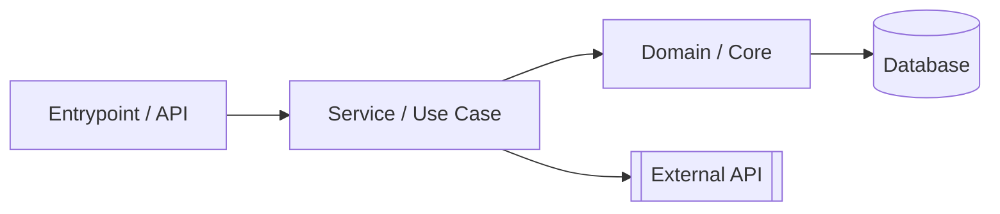
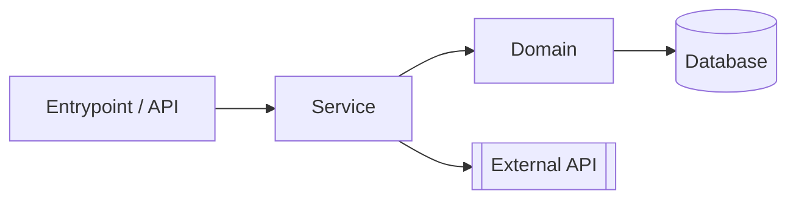

# Codex-OS — Analyze Product (Workflow Playbook)
> Location in repo: `.codex-os/instructions/core/analyze-product.md`  
> Primary output: `.codex-os/product/analysis.md` (create or overwrite)

## Purpose
Provide a clear, repeatable way to assess a codebase + product plan and produce a concise report with architecture, risks, quality signals, and next actions. Use this anytime you inherit a repo, before major refactors, or when a release requires a health check.

## Inputs (read in this order; skip if missing)
1. **Product docs**: `.codex-os/product/{mission.md, roadmap.md, decisions.md, stack.md}`
2. **Active specs**: `.codex-os/specs/**/{srd.md, tech-spec.md, tasks.md}`
3. **Repo**: source, tests, CI, Dockerfile/compose, infra-as-code
4. **Recent changes**: `git log -n 100 --oneline --decorate --graph`

## Primary Outputs
- **Report**: `.codex-os/product/analysis.md` (template below)
- **Follow-ups**:
  - Append ADRs to `.codex-os/product/decisions.md` when architecture is changed/proposed
  - Open or update tasks in the relevant spec’s `tasks.md`

## Safety & Execution
- Favor **read-only** commands first. Ask before running anything that installs packages, starts services, migrates DBs, or hits the network.
- Keep changes small and traceable. If you modify code or docs, reference the spec/task ID in commits.
- If assumptions are required, **write them down** inside the report.

---

## Procedure

### A) Discover the context
1. Summarize **mission**, **users**, **top jobs-to-be-done**, and **non-goals** from product docs.
2. List the **declared stack** vs **observed stack** (languages, frameworks, key services).
3. Skim the repo and capture quick stats:
   - Top directories and responsibilities
   - Test layout (unit/e2e/integration)
   - Presence of CI, lint/format, Docker

**Helpful (read-only) commands**
```bash
# Structure & languages
tree -L 2 || find . -maxdepth 2 -type d | sort
git ls-files | awk -F. '/\./{print $NF}' | sort | uniq -c | sort -nr | head

# Recent activity
git log -n 30 --oneline --decorate --graph

# JS/TS manifests (if present)
cat package.json 2>/dev/null || true
cat tsconfig.json 2>/dev/null || true

# Python manifests (if present)
cat pyproject.toml 2>/dev/null || true
cat requirements.txt 2>/dev/null || true
```

### B) Map the architecture
1. Identify modules, boundaries, and external integrations.
2. Sketch the runtime flow: entrypoints → controllers/handlers → domains → persistence → external services.
3. Outline data models and ownership.

**Include a diagram (edit as you learn):**


### C) Quality & health signals
Assess and record:
- **Tests**: presence, coverage, flakiness risk; run if safe
- **Lint/format**: config present? clean?
- **Security/deps**: known vulnerable libs; pinning/versioning approach
- **Performance**: obvious hotspots; baseline where practical
- **Docs**: README completeness; local dev bootstrap; ADRs presence
- **Observability**: logging shape; metrics/tracing hooks (if any)

**Optional (ask before running)**
```bash
# JS/TS
npm run -s lint || true
npm test --silent || true
npm audit || pnpm audit || true

# Python
ruff check || flake8 || true
pytest -q || true
pip-audit || safety check || true
```

### D) Product & roadmap alignment
- Are the current artifacts moving the product toward the stated mission and roadmap?
- Note mismatches, scope creep, and missing acceptance criteria in specs.

### E) Risks & dependencies
- Catalog **single points of failure**, complex areas, fragile tests, and external dependencies.
- Assign **likelihood** and **impact** to each risk (matrix template below).
- Note any compliance/privacy obligations touched by the design.

### F) Recommendations (prioritized)
- Propose 5–10 improvements. For each:
  - **Title**, **why**, **expected outcome**, **effort (S/M/L)**, **impact (1–5)**, **owner**.
  - Link to new or existing tasks in the relevant spec.

### G) Plan & next steps
- Suggest a 1–2 sprint plan with milestones and measurable checks.
- If major architecture changes are recommended, add an ADR in `product/decisions.md`.

---

## Report Template → `.codex-os/product/analysis.md`

```md
---
title: Product & Codebase Analysis
date: {{YYYY-MM-DD}}
version: 1
inputs:
  product_docs: [mission.md, roadmap.md, decisions.md, stack.md]
  specs_sampled:
    - .codex-os/specs/YYYY-MM-DD-example
repo_ref: <branch/commit>
---

# 1. Executive Summary
- **Mission fit:** <1–2 sentences>
- **Overall health:** <Green / Yellow / Red> — short justification
- **Top 3 risks:** <bullets>
- **Top 3 recommendations:** <bullets>

# 2. Product Context
- Users & jobs-to-be-done
- Non-goals / constraints
- KPIs / success criteria (baseline if known)

# 3. Architecture Overview
- High-level description
- Modules & boundaries
- Data flow
- External services

- Notes & assumptions

# 4. Quality & Health
- Tests: presence, coverage (if known), gaps
- Lint/format: status
- Security/dependencies: highlights
- Performance: hotspots or bottlenecks
- Documentation & onboarding
- Observability (logs/metrics/tracing)

# 5. Roadmap Alignment
- What’s planned vs. what exists
- Gaps, scope creep, missing ACs

# 6. Risks
| ID | Risk | Area | Likelihood | Impact | Notes |
|----|------|------|------------|--------|-------|
| R1 | <risk> | <module> | Low/Med/High | 1–5 | <notes> |
| R2 | ... | | | | |

# 7. Recommendations (Prioritized)
| # | Title | Why | Outcome | Effort | Impact | Owner |
|---|-------|-----|---------|--------|--------|-------|
| 1 | <do X> | <because> | <result> | S/M/L | 1–5 | <team> |
| 2 | ... | | | | | |

# 8. Plan
- Milestone 1 (week N): <deliverables, acceptance criteria>
- Milestone 2 (week N+1): <…>

# 9. Appendix
- Commands executed (if any)
- Assumptions
- Pointers to code, PRs, issues
```

---

## Checklists

**Analysis is done when:**
- [ ] `analysis.md` is written and linked to relevant specs
- [ ] 5–10 recommendations prioritized with clear acceptance criteria
- [ ] Risks scored with owners or follow-ups
- [ ] Any proposed architecture change captured as an ADR
- [ ] Open PRs/issues reference the spec/task IDs

**Quality bar (minimum):**
- [ ] Lint/format config present and runnable
- [ ] Tests runnable locally (even if few)
- [ ] README includes quickstart, test, and build instructions
- [ ] CI runs lint + tests

---

## Notes for Different Stacks

**JavaScript/TypeScript**
- Expect: `package.json`, `src/`, `tests/`, `tsconfig.json` (TS), ESLint/Prettier
- Consider: `pnpm` workspaces for monorepos, Vitest/Jest, Playwright for e2e

**Python**
- Expect: `pyproject.toml` (prefer), `src/` layout, `pytest`, `ruff` + `black`
- Consider: `pip-tools` or pinned uv/poetry; `mypy` for typing

**Services & Infra**
- Prefer Docker for consistent local runs
- If IaC present, record cloud resources and drift risks
- Ensure secrets are not committed; use `.env.example` + secret manager
